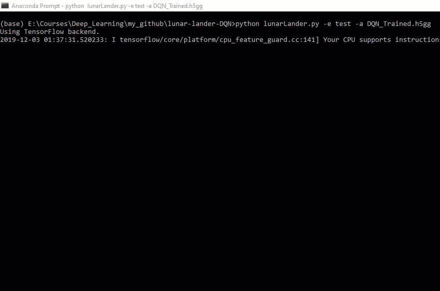

# lunar-lander-DQN
Implementation of a Reinforcement Learning agent (Deep Q-Network) for landing successfully the ‘Lunar Lander’ from the OpenAI Gym.

The aim of this project is to implement a Reinforcement Learning agent, for landing successfully the 'Lunar Lander' which (environment) is implemented in the OpenAI Gym (reference [1]). The problem is considered solved when the average total reward over 100 consecutive runs is at least 200. In my implementation the agent is a Deep Q-Network as described in (reference [2]). 

## Lunar Lander Environment
The Lunar Lander environment is based on the open source physics engine Box2D. The goal is to successfully land a spacecraft on the ground. The landing area is static and it is located always at the (0, 0) coordinates. The observation space of the environment consists of 8-dimensional states providing the following information about the spacecraft: x and y coordinates, x and y axes velocity components, angle and angular velocity and information about whether each of the two legs touch the ground. The action space consists of four discrete actions: do nothing and fire one of the left, right or main engines.

## Deep Q-Learning
My implementation is inspired by the Deep Q-Learning algorithm as described in reference [2]. The input to my Deep Q-Learner are the observations of the Lunar Lander environment. The Deep Neural Network I used, is implemented in Keras (using Tensor Flow as backend). In short, the Deep Q-Learning algorithm selects actions according an ε-greedy policy. Each experience tuple <s, a, r, s’> is stored in a Replay Memory structure. On each algorithm iteration, a random sample of these stored memories (minibatch) is selected and Q-Learning updates are applied to these samples. The detailed algorithm and the advantages of this approach are described in detail in reference [2].

## Components
The implementation of the project is in python and it is included in the below files:
```
lunarLander.py : Agent for landing successfully the 'Lunar Lander' which is implemented in OpenAI gym (reference [1]).

Classes:

deepNeuralNetwork.py : Deep Neural Network class implementation with Keras and Tensorflow (reference [3])
deepQNetwork.py      : Deep Q-Network class implementation (Implements a DQN, reference [2])
memory.py            : Memory class implementation (Replay Memory implementation, reference [2])
emulator.py          : RL Emulator class implementation (Implements a RL Emulator based on Open AI Gym, reference [1])
```

## Executing the project (Usage)
The project can be executed as explained below:
```
$python lunarLander.py -h
Using TensorFlow backend.
usage: lunarLander.py [-h] [-v {0,1,2}] -e {train,test} [-a A]

Lunar Lander with DQN

optional arguments:
  -h, --help       show this help message and exit
  -v {0,1,2}       verbose level (0: None, 1: INFO, 2: DEBUG)
  -e {train,test}  execute (train, test)
  -a A             trained agent file
``` 


### Training the agent
The training of the agent can be started by the following script execution:
```
$python lunarLander.py -e train

Statistics: episode = 00001, steps =   75, total_reward =  -115.704, 100_episodes_average_reward =  -115.704
Statistics: episode = 00002, steps =   92, total_reward =  -204.172, 100_episodes_average_reward =  -159.938
Statistics: episode = 00003, steps =  110, total_reward =  -484.729, 100_episodes_average_reward =  -268.202
....
```
The training ends when the default convergence criteria are met (he average total reward over 100 consecutive runs is at least 200). The trained agent is stored in the `./trained_model/DQN_Trained.h5` for future use.

During the training of the agent the below two graphs are produced, giving some details about the training performance:

#### Environment steps per episode, till convergence


#### Total reward per training episode, till convergence


### Testing a trained agent
By loading the stored trained agent (file `./trained_model/DQN_Trained.h5`), we can test its performance by the following script execution:
```
$python lunarLander.py -e test -a .\trained_model\DQN_Trained.h5

Statistics: episode = 00001, steps =  175, total_reward =   264.139, 1_episodes_average_reward =   264.139
```
The rendering feature of the OpenAI Gym is set to True for this step. Below is a succesful landing performed by the trained agent:



## System Requirements (Dependencies)
The script has been developed and verified in a **Python 3.6** environment. Installation details of python, can be found in the following link: [Python Installation](https://www.python.org/downloads/)

The script imports the below packages:

```
matplotlib, version 2.2.2
numpy, version 1.14.4
pandas, version 0.23.0
gym, version 0.10.8
Keras, version 2.2.4
tensorflow, version 1.11.0
```

* Installation details for matplotlib, numpy and pandas can be found in: [Scipy Packages Installation](https://www.scipy.org/install.html)
* Installation details for OpenAI gym can be found in: [OpenAI Gym Installation](https://gym.openai.com/docs/#installation)
* Installation details for Keras can be found in: [Keras Installation](https://keras.io/#installation)
* Installation details for TensorFlow can be found in: [TensorFlow Installation](https://www.tensorflow.org/install/)

**Note:** that for the 'Lunar Lander' case the Box2d 2D physics engine should be also available [More Installation details about OpenAI Gym](https://github.com/openai/gym#installing-everything)


## References
1. *OpenAI Gym, arXiv:1606.01540v1 [cs.LG].*
2. *Playing Atari with Deep Reinforcement Learning, arXiv:1312.5602v1 [cs.LG].*
3. *https://keras.io*
